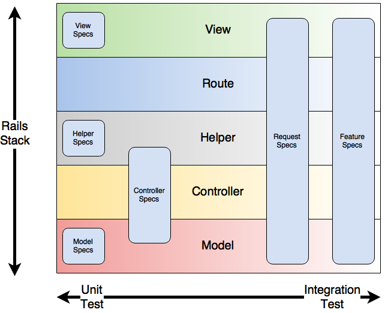

# Testing in isolation


^You and your friends plan a fun hike out in the wilderness

^After a day full of fun, you decide to turn back but no one knows exactly what way to go

^As the shadows lengthen, you start to straggle. You call out but no one listens.

^Soon, you are all alone in the darkened woods.

^Or so you think...

---


^Unbeknownst to you, a camera hidden in a nearby tree is focused upon you

^At the other end of the video feed, a voice exclaims "Sir! The test subject has
been isolated!"

^A man in a white lab coat stands up. "Excellent!", he replies, rubbing his
palms together in anticipation. "Proceed with test number 1-3-3-7"

^Sound like a scene out of a cheesy horror movie?

^Look closer. As developers, we all wear the white lab coat. We all get to be...
the tester.

---

## Why do we test?


^Start with the big question: Why do we test?

^Because everyone else does it?

^Because some guru wrote a blog post?

^We test because we want to be confident that we have working software

^We do it after we change code

^We all do it instinctively

---

## Two approaches


^When it comes to testing code, there are two broad approaches

---

### Testing Components

* Fast
* Simple
* Can be done in the console
* "Unit test"


^When you just want to test a component, you can load it up in the console and
call methods on it to make sure it works as expected.

^This is fast and simple.

^Called a "unit test"

^But sometimes you can loose the forest for the trees

---

### Testing the whole thing

* Slower
* More comprehensive
* Need to click around in the browser
* "Integration test"


^When you want to make sure your app as a whole functions, you boot up a server,
open a browser, and start clicking

^It's more comprehensive but is also more work

^This approach is known as "integration testing"

^Notice that nothing I've said so far has mentioned test tooling. You can and
often do go through these test workflows by hand.

^Automated testing exists because it's way too much work to test every edge case
by hand

---

## Rails test types



^In Rails, there are a lot of different automated test types

^Model, view and helper specs are on the unit test end of the spectrum

^Controller tests test a bit of the models and helpers too, making them a hybrid

^Finally, request and feature specs are on the integration end of the spectrum
since they exercise the full stack

^So which tests should you be writing?

---

## Testing pyramid


^All of them

^The testing pyramid is the idea that since integration specs are slow,
expensive, and test the full stack, you only need a few of them.

^All of the details get tested via fast, cheap unit tests

^But why are unit tests so much faster?

---

## Testing in isolation

^It all comes down to isolation

^Unit tests load less code, require less setup, and run experiments that are
smaller in scope than integration specs.

^How do you test something in isolation?

---


^Let's start with something easy

---

## No dependencies

```ruby
it "does something" do
  formatter = Formatter.new

  formatted_text = formatter.format("foo")

  expect(formatted_text).to eq "FOO"
end
```

^This test has no dependencies

^We give it a lowercase string and expect it to come out uppercased

^You've probably done this many times before

^Let's move on to a more interesting example

---


^But first, we need to address the elephant in the room.

^What exactly are we testing?

---

## Public-Private Partnerships


^Short answer: The behavior of an object

^Longer answer: The behavior of an object's _public API_

^An object's public methods are how the rest of the world interacts with it

^Objects have private methods to help with the work

^Typically, an object is like an iceberg: a few visible public methods held up
by many private methods.

^Don't try to test private methods

---

## Test the _what_, not the _how_

^When testing, it's important to focus on what an object does, not how it does
it

^Private methods are implementation details of an objects public behavior. They
are none of your business.

^With that out of the way, let's move on to objects that are part of a system

---

## Object graphs


^This is an object graph, modeling the relationships of objects in a system with
each other

^The yellow boxes are objects

^I've separated them into three orbits

^In green at the center, is the single object we are interested it: the one we
are testing

^Directly connected to it in the blue orbit, are other objects that help it do
it's job. These are it's collaborators

^Finally, all the collaborators have collaborators of their own that live in the
outer red orbit

^How might we test such a system?

---

## Introducing a collaborator

```ruby
class Formatter
  def format_name(user)
    "#{user.first_name} #{user.last_name}"
  end
end
```

^Let's take it one step at a time

^Here we have our old friend the formatter object

^There is now a collaborator involved

^Anyone know what the collaborator is here?

^Yes, it's the variable `user` but there's a twist because of:

---


^Because it's Ruby, the collaborator could be any object that has a first and
last name

---

## Duck typing

```ruby
class User < ActiveRecord::Base
 validates :first_name, presence: true
 validates :last_name, presence: true
end
```

^It could be a `User`...

---

## Duck typing

```ruby
class Guest
  def first_name
    "First"
  end

  def last_name
    "Last"
  end
end
```

^Or perhaps a Guest...

---

## Duck typing

```ruby
Duck = Struct.new(:first_name, :last_name)
```

^Or even your pet duck

^So why do we care?

---

## Test doubles

```ruby
it "formats a user's name" do
  formatter = Formatter.new
  user = double(first_name: "Joël", last_name: "Quenneville")

  formatted_text = formatter.format_name(user)

  expect(formatted_text).to eq "Joël Quenneville"
end
```

^Enter the test double

^Instead of having to create a Formatter _and_ a User and write a test that
exercises them both together, I can create a test double with a first and last
name as a stand-in for the collaborator

^Fun side note: test doubles got their name from stunt doubles in the movies

^By using a test double here, we've successfully isolated Formatter from it's
collaborator.

^The User class doesn't even need to exist, this test will pass

^Great!

---

## Dependency injection


^Part of the reason it was so easy to isolate in that test was because the
collaborator was passed in as an argument

^This is a technique known as dependency injection

^Dependency injection is a best practice used to keep objects loosely coupled to
their collaborators

^There's a virtuous cycle here: Loosely coupled objects are easier to test in
isolation and writing unit tests pushes you to couple your objects loosely

---

## Remember this object graph?


^Back to this object graph

^We looked at collaborators of our subject, but what about that outer red-orbit?

---

## Collaborators of collaborators

```ruby
class Formatter
  def comment_blurb(user)
    "Most recent comment:\n #{user.articles.comments.most_recent}"
  end
end
```

^we've got a long chain of collaborators here

^user.articles.comments.most_recent

---

## Graphical representation


^Let's look at a graphical representation

^We've got our subject, it's collaborator, and then dependency hell connected to
it

^How do you test code with Nth level collaborators?

---

## Test

```ruby
it "shows a blurb with most recent comment" do
  formatter = Formatter.new
  comment = double(body: "great post!")
  article = double(comments: [comment])
  user = double(articles: [article])

  formatted_text = formatter.comment_blurb(user)

  expect(formatted_text).to eq "Most recent comment:\n - great post!"
end
```

^This is how you test it: doubles on doubles on doubles

^Gross

---

## Test pain often points to architecture smells


^When tests, particularly setup get painful, it usually points to architecture
smells

---

## Law of Demeter


^In our case, we've violated the law of Demeter

^Demeter says not to play the telephone game where you tell your collaborator to
tell their collaborator to tell their collaborator to do something

^Demeter violations result in high coupling. Not only are we coupled to each of
the objects in the chain, but also to the structure of the chain. If any of the
relationships change, our Formatter will break.

---

## Desired result


^Demeter says you should just talk to your own collaborators.

^They're adults, they can figure out how to get you what you asked for without
you having to micromanage and tell how.

---

## Simpler Test...

```ruby
it "formats a user's name with their latest comment" do
  formatter = Formatter.new
  user = double(most_recent_comment: "great_post")

  formatted_text = formatter.comment_blurb(user)

  expect(formatted_text).to eq "Most recent comment: \n - great post!"
end
```

^Let's re-write the test the way we'd like it to read:

^A single double

---

## ... leads to simpler code

```ruby
class Formatter
  def comment_blurb(user)
    "Most recent comment:\n #{user.most_recent_comment}"
  end
end
```

^The source is simpler too

^No more long chain of dependencies

^Remember, this is all about Formatter. The implementation of
User#most_recent_comment doesn't matter here.

---

## Something harder


^We're starting to be good at this!

^Let's try something harder

---

## There are two types of methods...

```ruby
# query
def format(user)
  "#{user.first_name} #{user.last_name}"
end

# command
def save(data)
  HTTParty.post(ENDPOINT, data)
end
```

^There are two ways to write a method

^Queries (aka pure functions) are used for their return values

^Commands are used for what the actions they do. We don't care about the return

^So far we've been dealing with queries

^How do we isolate the HTTParty collaborator in the save command here?

---

## Stubbing

```ruby
it "posts to the API" do
  allow(HTTParty).to recieve(:post)
  data = double
  user = User.new

  user.save(data)

  expect(HTTParty).to have_recieved(:post).with(User::ENDPOINT, data)
end
```

^Time to introduce a new tool: stubbing

^We're telling RSpec to intercepts calls to our collaborator HTTParty

^After we've saved the user, we ask RSpec to confirm that it did intercept that
outgoing command

^Stubbing is an incredibly powerful ability

---

## Temptation...

```ruby
class Sasquatch
  def to_s
    "#{full_name} - Sasquatch"
  end
end
```

^Be careful

^When testing Sasquatch here you might be tempted to use stubbing to...

---


^Don't mess with Sasquatch!

---

## stubbing the system under test

```ruby
it "renders a textual representation of the user" do
  sasquatch = Sasquatch.new
  allow(sasquatch).to recieve(:full_name).and_return("First Last")

  expect(sasquatch.to_s).to eq "First Last - Sasquatch"
end
```

^Don't stub the subject that you are testing

^You're contaminating your experiment in a way that could incorrectly skew the
results

---


^In the worse case, you've written a test that's a Tautology

^a self-referential statement that's guaranteed to always be true

^tautological tests never fail

^Why might you be tempted to stub the system under test?

---

## The know it all

```ruby
class KnowItAll
  def do_a_thing
    # a lot of stuff
  end

  def do_another_thing
    do_a_thing
    # do some more stuff
  end
end
```

^Consider the know-it-all

^It has two methods that do a lot of things

^The second method do_another_thing calls the first one as part of what it does

^You don't want to re-test all of the behavior of do_a_thing in the tests for
do_another_thing

^Wouldn't be nice if you could instead treat do_a_thing as if it were a
collaborator?

---

## Extract Class

```ruby
class AnotherThing
  def do_another_thing(know_it_all)
    know_it_all.do_a_thing
    # do some more stuff
  end
end
```

^Turns out you can!

^Extract a separate class and pass in the know it all as a collaborator

^Now you can use a double to stand in for the know it all on only test the
behavior that you've written as part of do_another_thing

---

## Single Responsibility

^This sort of situation often happens when an object is trying to do too much
and has too many methods

^How do objects get this way? Objects core to the domain of your app tend to
accumulate code naturally.

^Long inheritance chains and modules also add to the method count

---

## Prefer composition to inheritance

^In general, prefer composition to inheritance when architecting your code

^Your tests will thank you

---

## Command/Query separation (not!)

```ruby
class User
  def self.create(data)
    response = HTTParty.post(data)
    if response.success?
      new(response.body)
    else
      false
    end
  end
end
```

^So when I mentioned there were two type of methods, I left out a third type

^Some methods are both commands and queries

^These methods are a mess of complexity

^As much as possible, try to separate your queries from your commands

^If you do have to test one, combine all the tricks we saw so far to take down
the monster!

^The test for this code was too long to put on a slide

---

## Working with your framework


^That's all nice in practice but when working with a framework you have to make
some compromises

^Don't try to isolate ActiveRecord models from the database

^Don't try to isolate controllers in controller tests

^In general, be pragmatic

---

## Principles of testing

* Isolate your subject
* Don't mess with the subject
* If you feel pain, maybe rethink your implementation

---

## What about integration tests?


^Turns out they work the same as unit tests

^But your subject is a sub-system or even the whole application

---

## Stubbing the system under test

^You may be tempted to stub parts of the app during an integration test

---


^Remember, don't mess with Sassquatch!

---

## Boundaries


^In an integration test, the your collaborators are other subsystems or other
apps

^Perhaps over the network

^Use stubbing at the boundaries to isolate your subject from it's collaborators

---

## Principles of testing

* Isolate your subject
* Don't mess with the subject
* If you feel pain, maybe rethink your implementation

^In the end, the principles of testing are the same

---


^So put on that white lab coat

^Isolate your subject

^It's time to kick off test 1-3-3-7...

---

## Questions?

---

## Slides:

http://github.com/JoelQ/testing-in-isolation
